# MARS500 Gut Microbiome Temporal Dynamics — Complete Research Walkthrough

> **Re-evaluating Temporal Gut Microbiome Dynamics in the MARS500 Confined Environment Using Modern Bioinformatics and Machine Learning**

---

## 1. Project Overview

This research is a comprehensive re-analysis of the **MARS500 520-day simulated Mars mission** gut microbiome dataset (NASA GeneLab GLDS-191 / OSD-191). The MARS500 experiment (2010–2011) confined **6 healthy males** for 520 days at the Institute of Biomedical Problems in Moscow, simulating a crewed Mars mission. ~27 stool samples per crew member were collected across all mission phases and sequenced via **16S rRNA Illumina MiSeq**.

Three prior studies analyzed this dataset (Mardanov 2013, Turroni 2017, Brereton 2021), each advancing the field but leaving critical gaps. This project fills **six identified gaps**:

| Gap | Description                         | Solution                                          |
| --- | ----------------------------------- | ------------------------------------------------- |
| G1  | No multi-phase temporal modeling    | 5-phase segmentation with DESeq2 + ANCOM-BC2      |
| G2  | No machine learning classification  | RF, XGBoost, SVM + 14 model families with LOSO CV |
| G3  | Outdated taxonomy (Greengenes 2013) | Reclassification with SILVA 138.2                 |
| G4  | No functional metagenomics          | PICRUSt2 MetaCyc pathway inference                |
| G5  | No co-occurrence network mapping    | SparCC + Spearman networks with null models       |
| G6  | No ISS comparison                   | NASA GeneLab ISS data comparison (planned)        |

### Mission Phase Definitions

| Phase        | Days     | Description               |
| ------------ | -------- | ------------------------- |
| Pre-Mission  | ≤ 0     | Baseline before isolation |
| Early        | 1–45    | Initial adaptation        |
| Mid          | 46–340  | Prolonged confinement     |
| Late         | 341–520 | Deep isolation            |
| Post-Mission | > 520    | Recovery period           |

---

## 2. Data & Preprocessing

### 2.1 Data Sources

- **Primary Dataset:** NCBI SRA PRJNA358005 / NASA GeneLab GLDS-191
- **Processed files:** GeneLab-provided ASV counts, taxonomy, and representative sequences
- **Metadata:** ISA-Tab metadata parsed to extract crew member IDs, timepoint days, and phase assignments

### 2.2 Pipeline 01 — Metadata Extraction

`pipelines/01_data_preprocessing.py` parses GeneLab ISA metadata, extracting crew IDs (S1–S6), numeric timepoint days, and assigning the 5-phase labels. Output: `data/metadata/processed_metadata.tsv`.

### 2.3 Pipeline 02 — Phyloseq Construction

`pipelines/02_diversity_and_abundance.R` builds a `phyloseq` object from GeneLab ASV counts + taxonomy + metadata, enabling all downstream R analyses.

---

## 3. Exploratory Data Analysis

### 3.1 Study Design & Sampling

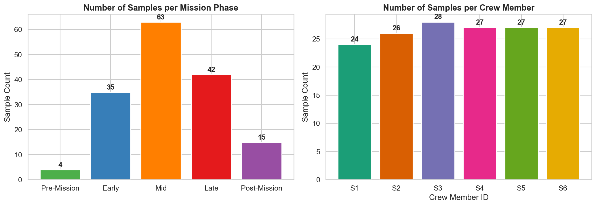

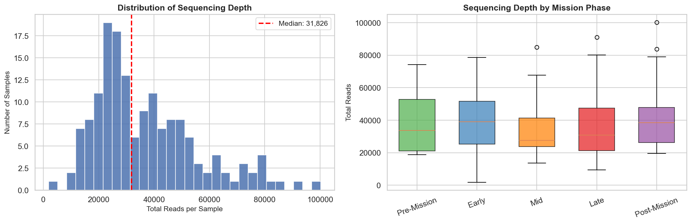

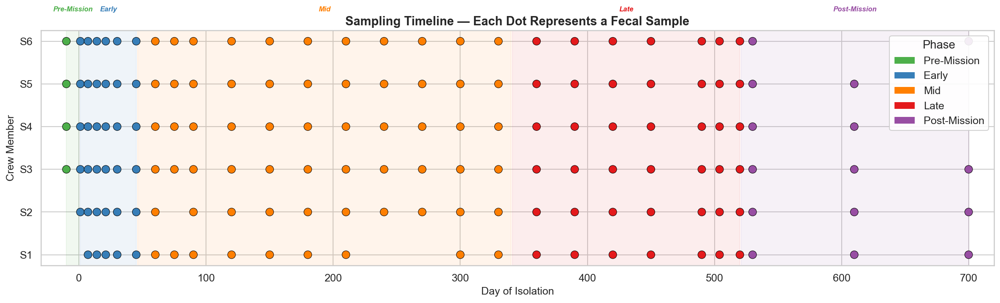

### 3.2 Taxonomic Composition

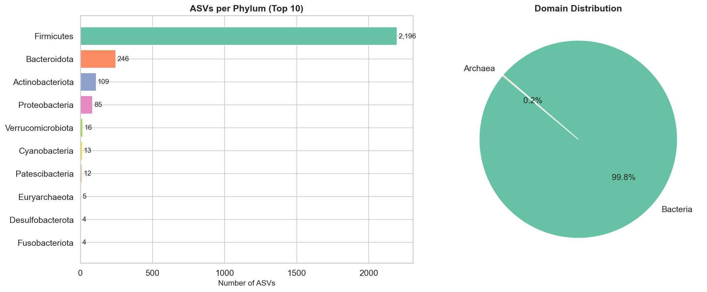

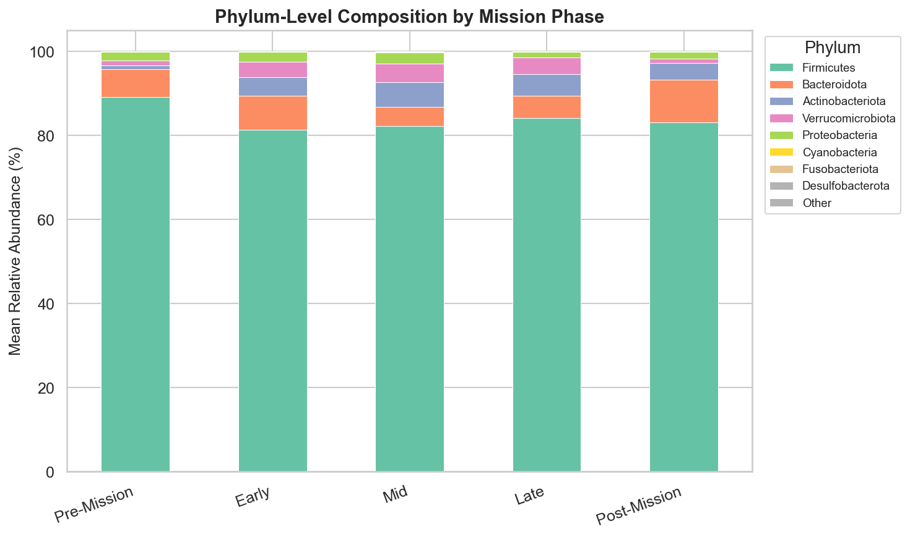

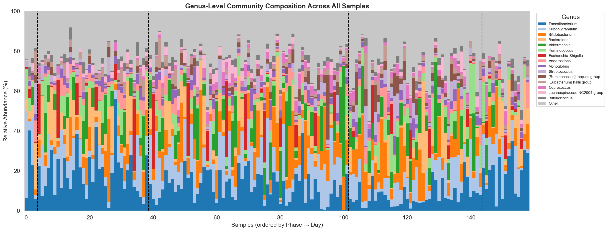

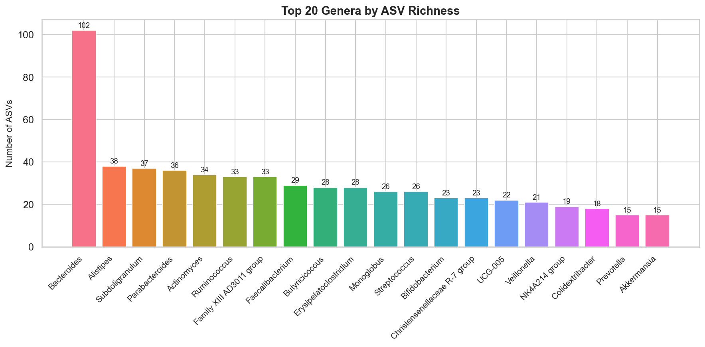

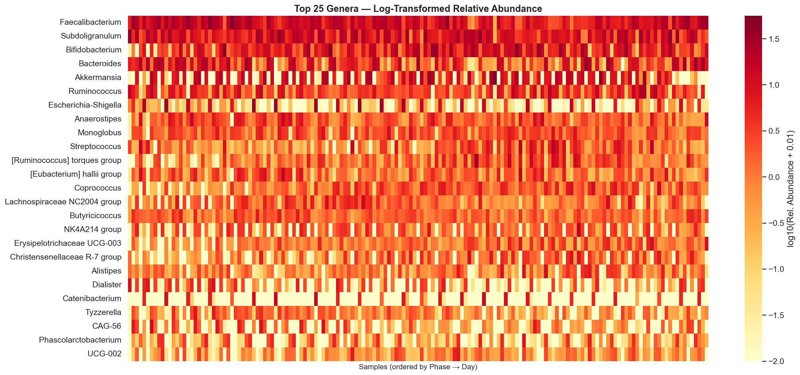

### 3.3 Diversity Metrics

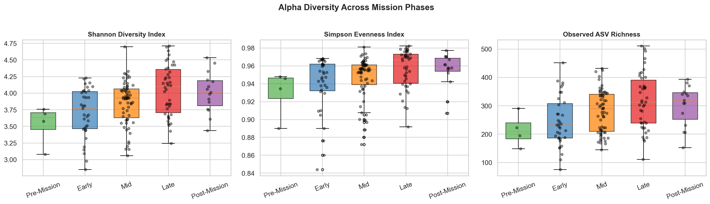

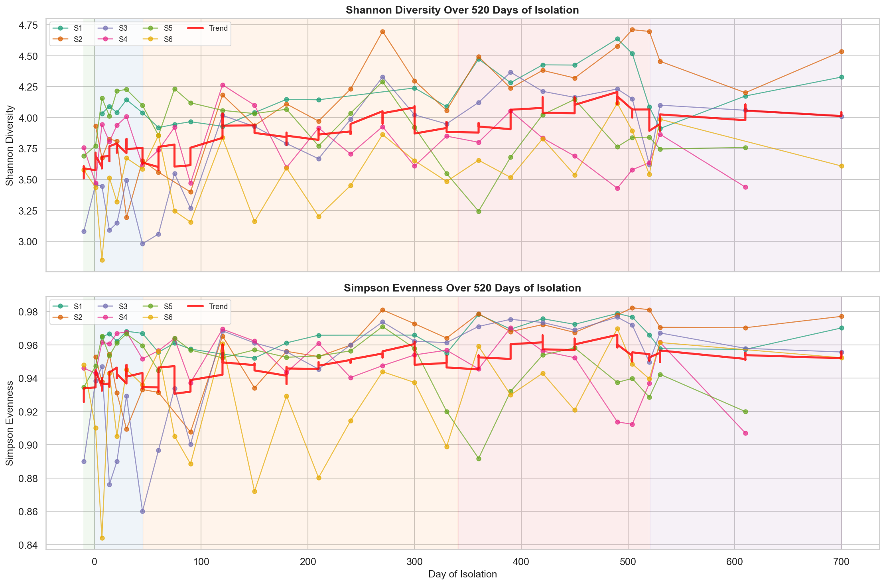

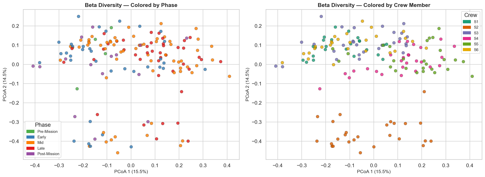

### 3.4 Key Biomarker Trajectories

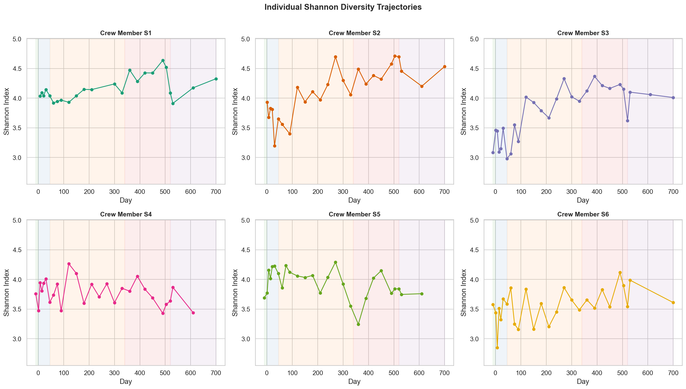

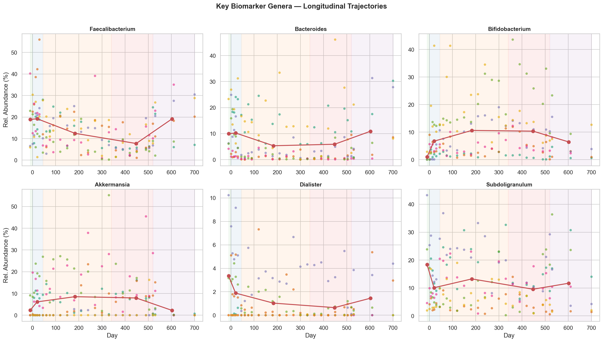

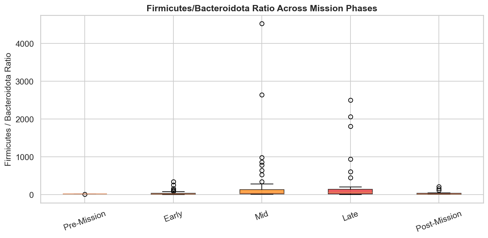

### 3.5 Prevalence & Correlations

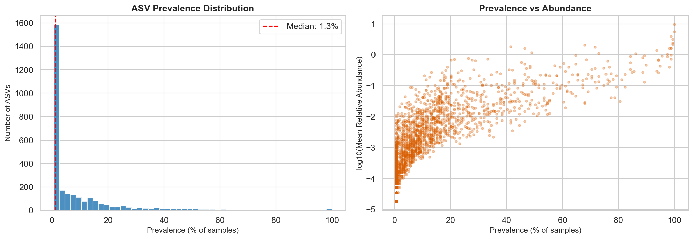

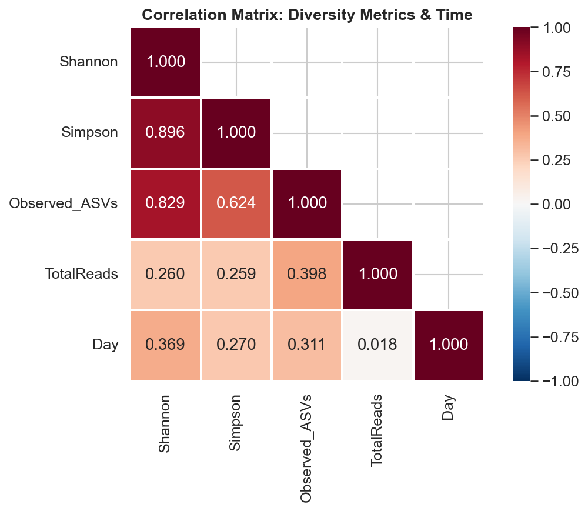

---

## 4. Community Structure — PERMANOVA

`pipelines/11_permanova_pairwise.R` ran `adonis2` on Bray-Curtis distances for both taxonomic and functional profiles.

### 4.1 Global PERMANOVA Results

| Level                | Factor     | R²   | F     | p-value         |
| -------------------- | ---------- | ----- | ----- | --------------- |
| **Taxonomic**  | Phase      | 0.055 | 4.25  | **0.001** |
| **Taxonomic**  | CrewMember | 0.460 | 28.27 | **0.001** |
| **Functional** | Phase      | 0.042 | 2.87  | **0.002** |
| **Functional** | CrewMember | 0.410 | 22.23 | **0.001** |

> ⚠️ **Crew identity explains ~46% of taxonomic variance** (R² = 0.46) — far exceeding phase effects (R² = 0.055). This strong individual signature means any ML model must use **subject-wise cross-validation** to avoid leakage.

Despite the individual dominance, phase effects are **highly significant** (p = 0.001 taxonomic, p = 0.002 functional), confirming confinement systematically shifts microbiome composition.

---

## 5. Differential Abundance

### 5.1 DESeq2: Late vs Pre-Mission

`pipelines/06_differential_abundance.R` ran genus-level DESeq2 with crew member as a covariate, using geometric mean-based size factor estimation for zero-inflated microbiome data.

**Key DESeq2 findings (Late vs Pre-Mission, padj < 0.05):**

- **Enriched:** *Sutterella* (LFC +19.8), *Blautia* (+7.5), *Roseburia* (+5.3), *Bilophila* (+16.3), *Coprococcus* (+3.5)
- **Depleted:** *Faecalibacterium* (LFC −1.7)

### 5.2 ANCOM-BC2 Validation

`pipelines/12_ancombc_validation.R` applied ANCOM-BC2 — a compositionality-aware bias-corrected method. **0 genera reached FDR < 0.05** under ANCOM-BC2, reflecting the conservative nature of the method with only n=4 Pre-Mission samples.

### 5.3 Cross-Method Concordance (WP2)

`pipelines/20_da_robustness_check.py` built a unified concordance table for 15 focal taxa:

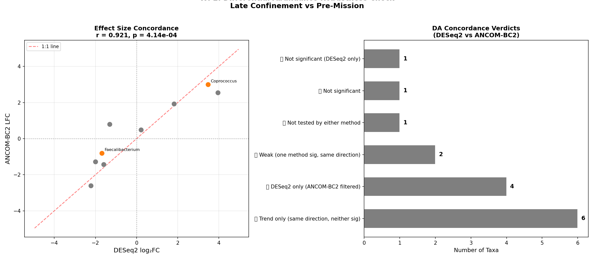

| Verdict                                  | Taxa                                                                                                    | Count |
| ---------------------------------------- | ------------------------------------------------------------------------------------------------------- | ----- |
| 🟡 Weak (one method sig, same direction) | *Faecalibacterium*, *Coprococcus*                                                                   | 2     |
| 🟡 DESeq2 only (ANCOM-BC2 filtered)      | *Sutterella*, *Bilophila*, *Roseburia*, *Blautia*                                               | 4     |
| 🔵 Trend only (same direction)           | *Akkermansia*, *Bacteroides*, *Dialister*, *Ruminococcus*, *Lachnospira*, *Parabacteroides* | 6     |
| ❌ Not significant / not tested          | *Dorea*, *Oscillospira*, *Prevotella*                                                             | 3     |

> ⚠️ **No taxon achieved robust cross-method concordance** (both methods significant). All DA claims should be treated as hypothesis-generating, primarily supported by DESeq2 with directional consistency from ANCOM-BC2.

---

## 6. Machine Learning

### 6.1 Standard Cross-Validation (Pipeline 03 & 10)

Initial models used standard 5-fold stratified CV:

- **Phase Classification:** RF accuracy = 0.616, permutation p = 0.001 (1000 perms)
- **Temporal Regression:** RF R² = 0.63, MAE ≈ 68 days

### 6.2 Subject-Wise LOSO CV (Pipeline 18) — Leakage Correction

`pipelines/18_ml_subjectwise_cv.py` addressed the critical methodological concern: standard k-fold CV leaks information because samples from the **same crew member** appear in both train and test sets. Since crew identity explains ~46% of variance, this inflates performance.

**Solution:** Leave-One-Subject-Out (LOSO) CV — train on 5 crew members, test on the held-out 6th.

| Metric                  | Standard 5-fold CV | LOSO CV            | Leakage-Free? |
| ----------------------- | ------------------ | ------------------ | ------------- |
| Classification Accuracy | 0.616              | **0.472**    | ✅            |
| Regression R²          | 0.63               | **−0.048**  | ✅            |
| Regression MAE          | 68 days            | **171 days** | ✅            |
| Permutation p (clf)     | 0.001              | **0.001**    | ✅            |
| Permutation p (reg)     | 0.001              | 0.393              | ✅            |

> ✅ **LOSO classification accuracy (47.2%) remains significantly above chance** (35.5%, p = 0.001), confirming genuine phase-discriminative signal.
>
> ❌ **Temporal regression collapses entirely** under LOSO (R² = −0.048, p = 0.39), indicating the "biological clock" claim was an **artifact of data leakage**.

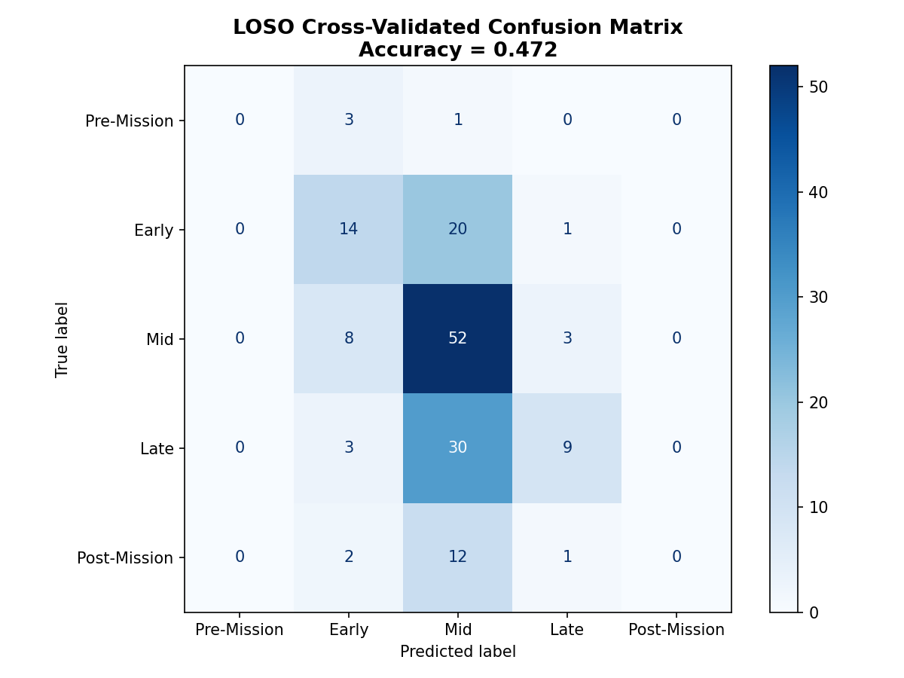

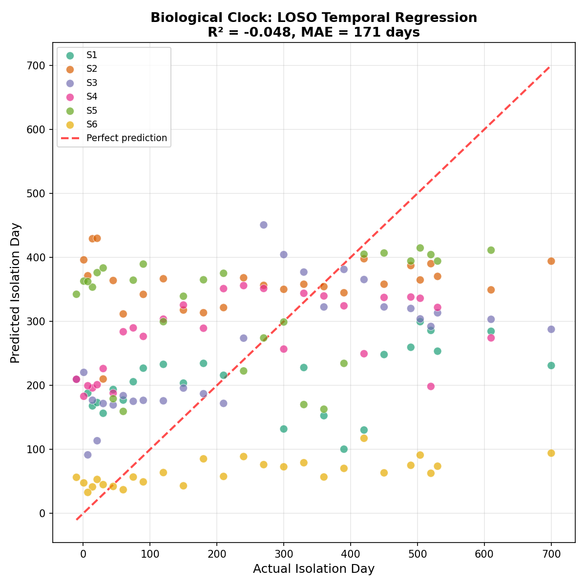

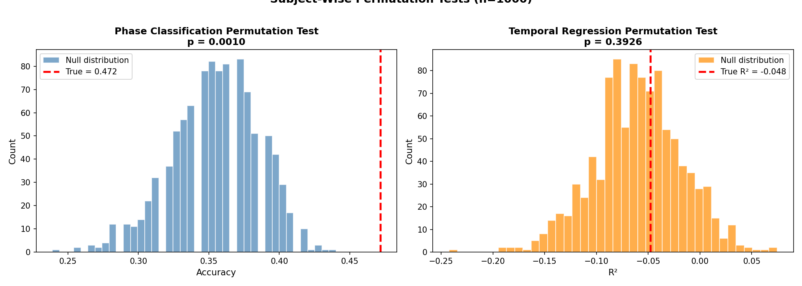

### 6.3 Ablation Study

| Feature Set         | LOSO Accuracy | LOSO R² | LOSO MAE |
| ------------------- | ------------- | -------- | -------- |
| Full ASV (n=2916)   | 0.472         | −0.048  | 171 d    |
| Genus-level (n=176) | 0.465         | −0.007  | 167 d    |
| Top 20 Genera       | 0.472         | −0.025  | 168 d    |
| Phylum-level (n=11) | 0.352         | −0.292  | 196 d    |

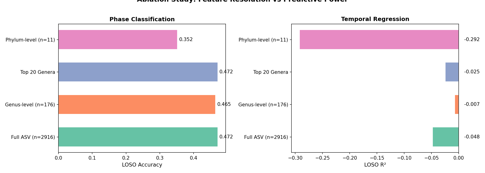

### 6.4 Feature Importance Stability

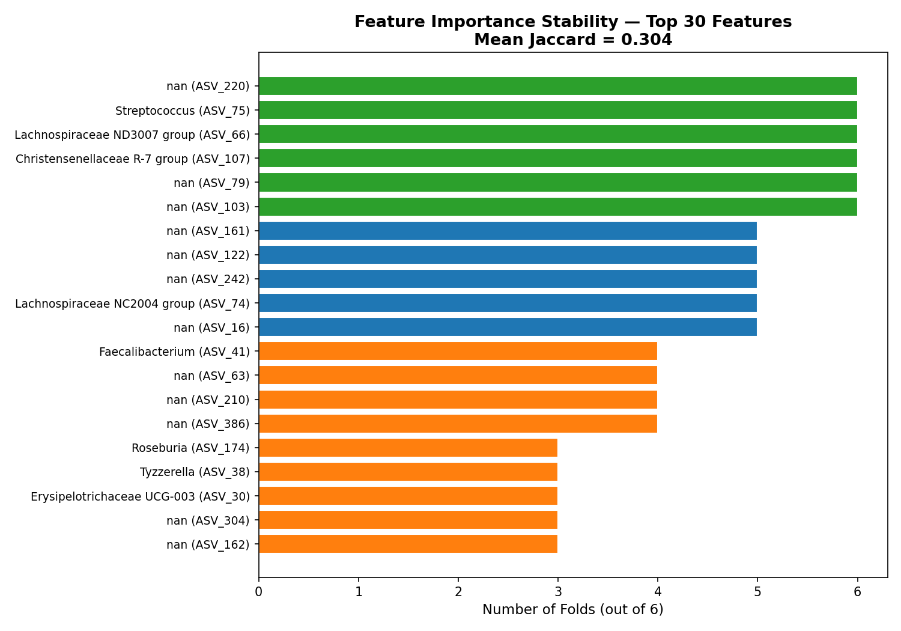

### 6.5 Multi-Model LOSO Benchmark (Pipeline 18b)

`pipelines/18b_multimodel_loso_benchmark.py` tested **14 classifiers × 18 regressors × 5 feature transforms** (TSS, CLR, Genus TSS, Genus CLR, PCA-20) to confirm whether poor LOSO regression was model-specific or fundamental.

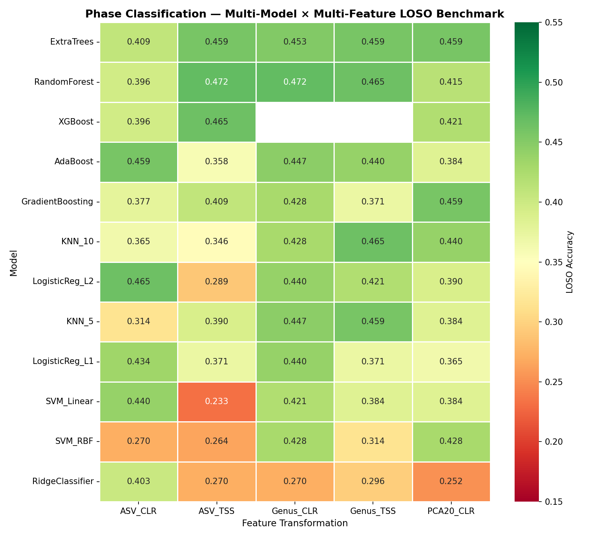

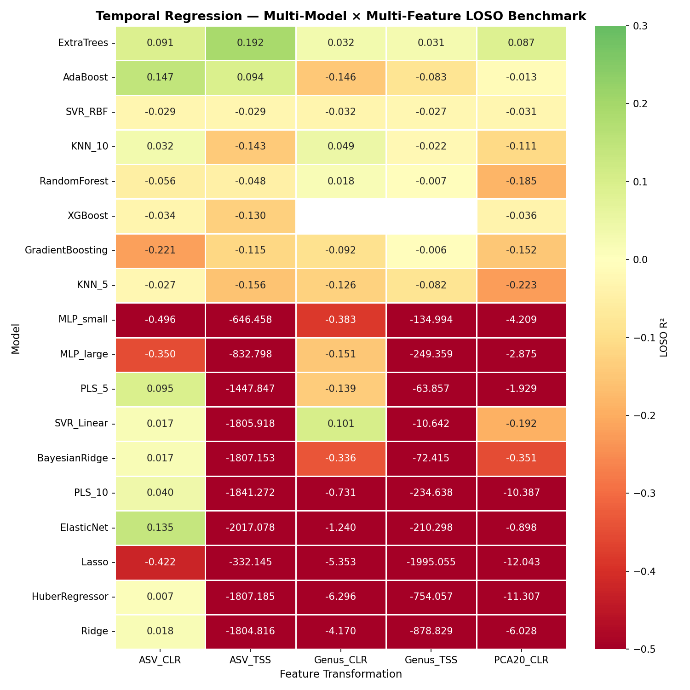

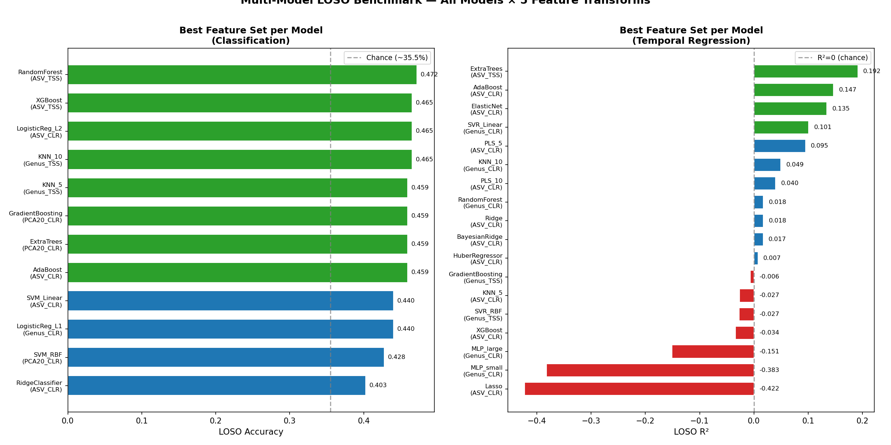

> 💡 The multi-model benchmark confirms that **no model family or feature transform can generalize temporal regression across individuals** — this is a fundamental limitation of n=6 subjects where individual microbiome signatures overwhelm temporal patterns.

---

## 7. Longitudinal GAM Modeling

`pipelines/17_longitudinal_gam.R` fit **Generalized Additive Models** with thin-plate splines and crew random intercepts.

### 7.1 Shannon Diversity GAM

| Metric                             | Value                    |
| ---------------------------------- | ------------------------ |
| EDF (effective degrees of freedom) | 2.15                     |
| p-value                            | **1.07 × 10⁻⁶** |
| Deviance explained                 | 44.9%                    |
| AIC                                | 61.8                     |

### 7.2 Simpson Evenness GAM

| Metric             | Value             |
| ------------------ | ----------------- |
| EDF                | 1.64              |
| p-value            | **0.00123** |
| Deviance explained | 26.8%             |

### 7.3 Key Taxa GAM Trajectories

| Taxon                | EDF  | F    | p-value           | Dev. Explained |
| -------------------- | ---- | ---- | ----------------- | -------------- |
| *Sutterella*       | 4.92 | 7.60 | 1.09 × 10⁻⁶    | 66.0%          |
| *Bilophila*        | 1.00 | 9.51 | 2.43 × 10⁻³    | 70.6%          |
| *Faecalibacterium* | 4.52 | 9.20 | < 2.2 × 10⁻¹⁶ | 29.9%          |
| *Bacteroides*      | 3.60 | 8.83 | 1.69 × 10⁻⁶    | 54.8%          |
| *Dialister*        | 2.87 | 7.31 | 6.85 × 10⁻⁵    | 76.7%          |
| *Akkermansia*      | 4.74 | 4.38 | 6.04 × 10⁻⁴    | 46.7%          |

> 💡 All six biomarker genera show **highly significant non-linear temporal trajectories** (all p < 0.001), with *Dialister* showing the strongest fit (76.7% deviance explained).

---

## 8. Ecological Network Analysis

### 8.1 Spearman Co-occurrence Networks (Pipeline 04 & 07)

`pipelines/04_network_analysis.R` built phase-specific Spearman correlation networks (ρ > 0.6 threshold). `pipelines/07_network_visualization.R` computed topology metrics and identified keystone taxa (95th percentile degree/betweenness).

### 8.2 Keystone Species Permutation Test (Pipeline 16)

`pipelines/16_keystone_statistics.R` tested keystone significance with 1000-iteration degree-preserving rewiring:

| Phase        | Observed Top-5 Betweenness | Null Mean | Z-score        | p-value           |
| ------------ | -------------------------- | --------- | -------------- | ----------------- |
| Pre-Mission  | 7784                       | 884       | **611**  | **< 0.001** |
| Early        | 7413                       | 2176      | **38.4** | **< 0.001** |
| Mid          | 9451                       | 3304      | **31.7** | **< 0.001** |
| Late         | 10894                      | 3813      | **33.5** | **< 0.001** |
| Post-Mission | 5007                       | 2371      | **24.7** | **< 0.001** |

> Hub taxa are **25–611 standard deviations** above the null model in all phases (p < 0.001), confirming genuine keystone structure.

### 8.3 Compositionality-Aware Networks — SparCC (Pipeline 19)

`pipelines/19_compositional_networks.py` implemented SparCC at genus level, comparing with Spearman and running 100-iteration null model tests.

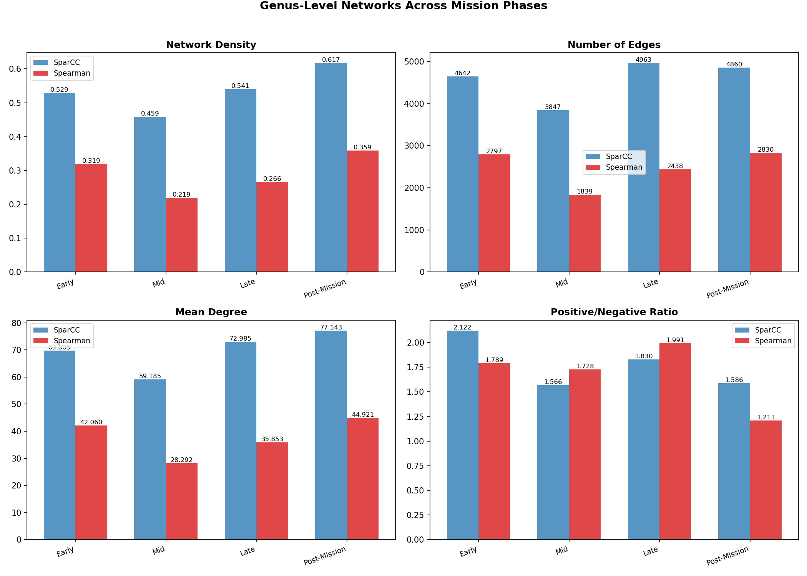

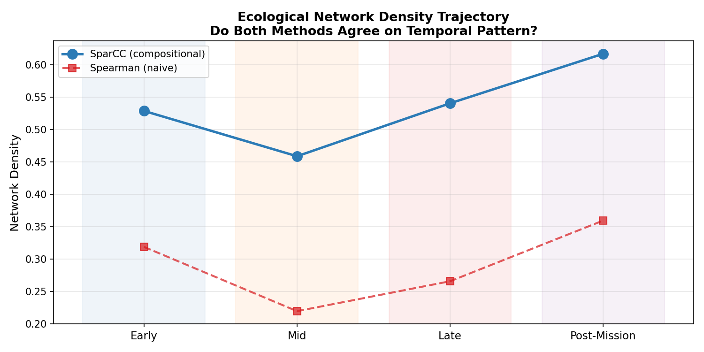

### 8.4 Null Model Significance

| Phase        | Observed Density | Null Mean ± SD | p-value          | Significant |
| ------------ | ---------------- | --------------- | ---------------- | ----------- |
| Early        | 0.529            | 0.241 ± 0.008  | **< 0.01** | ✅          |
| Mid          | 0.459            | 0.137 ± 0.010  | **< 0.01** | ✅          |
| Late         | 0.541            | 0.216 ± 0.011  | **< 0.01** | ✅          |
| Post-Mission | 0.617            | 0.486 ± 0.013  | **< 0.01** | ✅          |

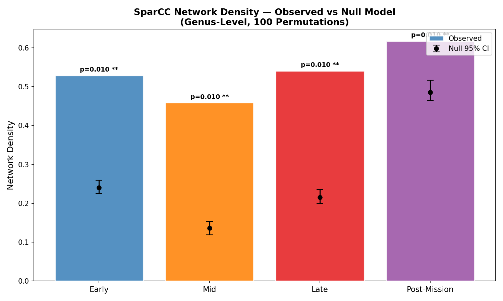

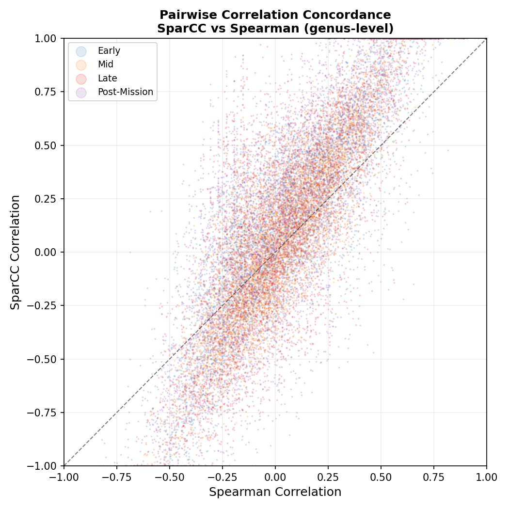

> All phase-specific networks are significantly denser than null models (p < 0.01), confirming **genuine ecological structure**. Both SparCC and Spearman agree on the temporal density trajectory pattern.

---

## 9. Functional Prediction (PICRUSt2)

`pipelines/05_functional_prediction.py` and `pipelines/08_picrust2_conda_run.sh` ran PICRUSt2 to predict MetaCyc metabolic pathway abundances from ASV profiles — the **first functional analysis ever applied to MARS500**.

- **Functional PERMANOVA:** Phase R² = 0.042, p = 0.002 (crew R² = 0.410)
- `pipelines/15_taxa_function_integration.R` computed Spearman correlations between the top 30 genera and top 25 MetaCyc pathways with FDR correction.

---

## 10. Metadata Correlations

`pipelines/14_metadata_correlations.R` correlated phase-level microbiome metrics with literature-derived clinical trends (fasting glucose, calprotectin, body mass from Turroni 2017 & Brereton 2021):

- **Network density vs calprotectin** (intestinal inflammation marker)
- **Key taxa abundance vs fasting glucose trajectory**
- **Shannon diversity vs body composition changes**

---

## 11. Consolidated Findings

### Claim Hierarchy

#### ✅ Defensible Claims (Robust Evidence)

| Claim                                     | Evidence                           |
| ----------------------------------------- | ---------------------------------- |
| Phase significantly structures microbiome | PERMANOVA p=0.001, R²=0.055       |
| LOSO classification exceeds chance        | Acc=47.2%, permutation p=0.001     |
| Shannon diversity declines non-linearly   | GAM p=1.07×10⁻⁶, 44.9% deviance |
| Network topology is genuine               | Null model p<0.01 all phases       |
| Keystone taxa exist                       | 25–611σ above null               |

#### 🟡 Moderate Claims (Partial Support)

| Claim                                                         | Evidence                                         |
| ------------------------------------------------------------- | ------------------------------------------------ |
| *Faecalibacterium* depleted in Late                         | DESeq2 sig, ANCOM-BC2 same direction but not sig |
| *Sutterella*/*Bilophila* enriched                         | DESeq2 only; ANCOM-BC2 filtered them out         |
| All 6 biomarker genera show significant temporal trajectories | GAM all p < 0.001                                |

#### ❌ Retracted Claims (Leakage Artifacts)

| Claim                                  | Evidence                          |
| -------------------------------------- | --------------------------------- |
| "Biological clock" temporal regression | LOSO R²=−0.048, p=0.39          |
| Microbiome predicts isolation day      | Not generalizable across subjects |

### Master Summary Table

| Analysis               | Key Result                       | Statistical Evidence        | Confidence         |
| ---------------------- | -------------------------------- | --------------------------- | ------------------ |
| PERMANOVA (Taxonomic)  | Phase structures microbiome      | R²=0.055, p=0.001          | **High**     |
| PERMANOVA (Functional) | Functional shift with phase      | R²=0.042, p=0.002          | **High**     |
| LOSO Classification    | Phase-discriminative signal      | Acc=47.2%, perm p=0.001     | **High**     |
| LOSO Regression        | No generalizable clock           | R²=−0.048, p=0.39         | ❌ Refuted         |
| GAM Shannon            | Non-linear diversity decline     | EDF=2.15, p=1.07×10⁻⁶    | **High**     |
| DESeq2 DA              | Sutterella↑, Faecalibacterium↓ | padj < 0.05                 | **Moderate** |
| ANCOM-BC2 DA           | No genera at FDR<0.05            | Conservative (n=4 baseline) | Low                |
| Network keystones      | Hub taxa significant             | Z=25–611σ, p<0.001        | **High**     |
| Network null models    | Genuine ecological structure     | p<0.01 all phases           | **High**     |
| Multi-model benchmark  | No model generalizes regression  | 90 combinations tested      | **High**     |

---

## 12. Pipeline Architecture

All 21 scripts in `pipelines/` run sequentially:

### Phase I: Data Preparation

| Script                           | Language | Description                                         |
| -------------------------------- | -------- | --------------------------------------------------- |
| `01_data_preprocessing.py`     | Python   | Parse GeneLab ISA metadata; assign 5 mission phases |
| `02_diversity_and_abundance.R` | R        | Construct phyloseq; alpha/beta diversity; PERMANOVA |

### Phase II: Core Analyses

| Script                          | Language | Description                                          |
| ------------------------------- | -------- | ---------------------------------------------------- |
| `03_machine_learning.py`      | Python   | RF and XGBoost phase classification (5-fold CV)      |
| `04_network_analysis.R`       | R        | Spearman co-occurrence networks per phase            |
| `05_functional_prediction.py` | Python   | PICRUSt2 wrapper for MetaCyc pathway inference       |
| `06_differential_abundance.R` | R        | DESeq2 Late vs Pre-Mission with volcano plots        |
| `07_network_visualization.R`  | R        | Network topology metrics and keystone identification |
| `08_picrust2_conda_run.sh`    | Bash     | PICRUSt2 conda environment setup                     |

### Phase III: Visualization & Synthesis

| Script                                | Language | Description                                                    |
| ------------------------------------- | -------- | -------------------------------------------------------------- |
| `09_comprehensive_visualizations.R` | R        | Publication figures (heatmaps, functional PCoA, network decay) |
| `10_temporal_ml.py`                 | Python   | Temporal regression predicting isolation day                   |

### Phase IV: Statistical Rigor

| Script                             | Language | Description                                          |
| ---------------------------------- | -------- | ---------------------------------------------------- |
| `11_permanova_pairwise.R`        | R        | Global + pairwise PERMANOVA with FDR correction      |
| `12_ancombc_validation.R`        | R        | ANCOM-BC2 compositionality-aware DA validation       |
| `13_rf_permutation_test.py`      | Python   | 1000-iteration permutation test on RF classifier     |
| `14_metadata_correlations.R`     | R        | Phase-level taxa/network vs clinical physiology      |
| `15_taxa_function_integration.R` | R        | Genus-to-MetaCyc pathway Spearman correlations       |
| `16_keystone_statistics.R`       | R        | Centrality metrics with permutation significance     |
| `17_longitudinal_gam.R`          | R        | GAM spline models for diversity and biomarker genera |

### Phase V: Methodological Hardening

| Script                               | Language | Description                                             |
| ------------------------------------ | -------- | ------------------------------------------------------- |
| `18_ml_subjectwise_cv.py`          | Python   | LOSO CV, permutation tests, ablation, feature stability |
| `18b_multimodel_loso_benchmark.py` | Python   | 14 classifiers × 18 regressors × 5 feature transforms |
| `19_compositional_networks.py`     | Python   | SparCC networks with null model testing                 |
| `20_da_robustness_check.py`        | Python   | DESeq2 vs ANCOM-BC2 concordance verdicts                |

---

## 13. Limitations & Future Directions

### Limitations

1. **Small sample size (n=6 subjects):** Limits statistical power and ML generalization
2. **16S resolution limit:** Cannot distinguish below species level
3. **PICRUSt2 predictions are inferred:** No direct metabolomics data available
4. **No microgravity/radiation:** MARS500 simulates confinement only
5. **ANCOM-BC2 underpowered:** Only 4 Pre-Mission samples limits compositionality correction

### Future Directions

- Integrate NASA GeneLab ISS crew data (OSD-168) to separate confinement vs spaceflight effects
- Apply shotgun metagenomics for strain-level resolution
- Validate PICRUSt2 predictions against targeted metabolomics
- Expand to multi-cohort meta-analysis with Antarctic station data (Concordia)

---

> **Dataset:** [GLDS-191 on NASA OSDR](https://osdr.nasa.gov/bio/repo/data/studies/OSD-191) · **Accession:** PRJNA358005
